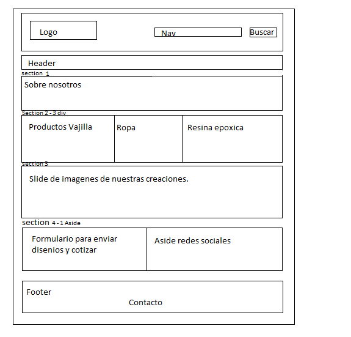
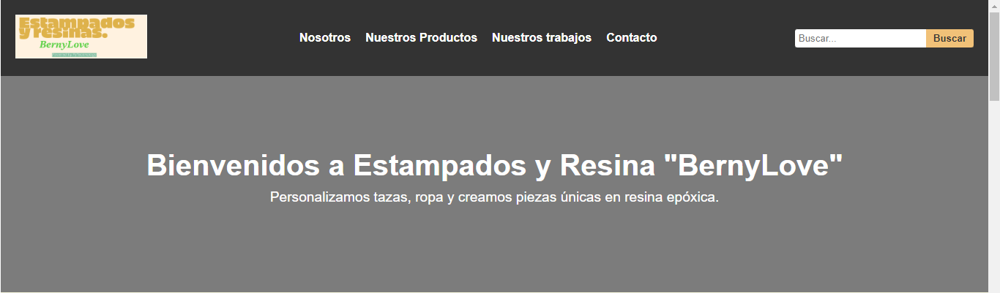
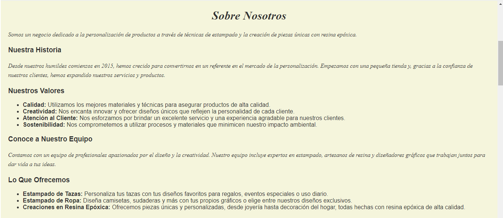
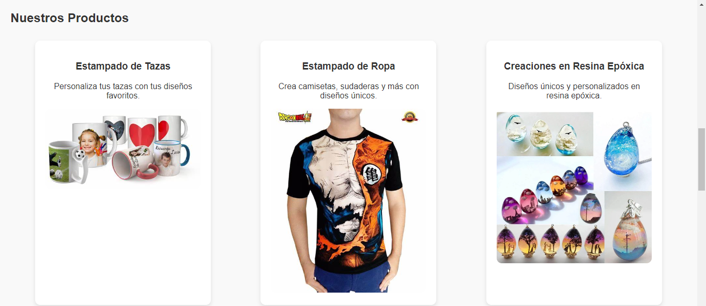
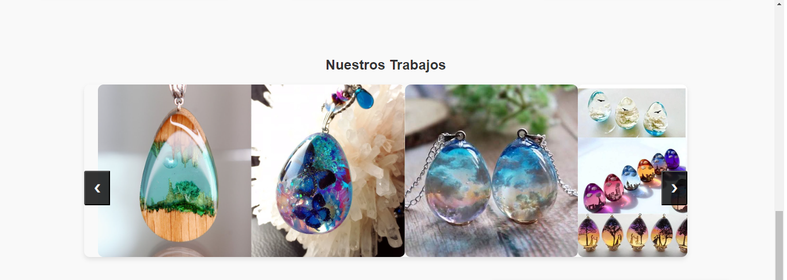
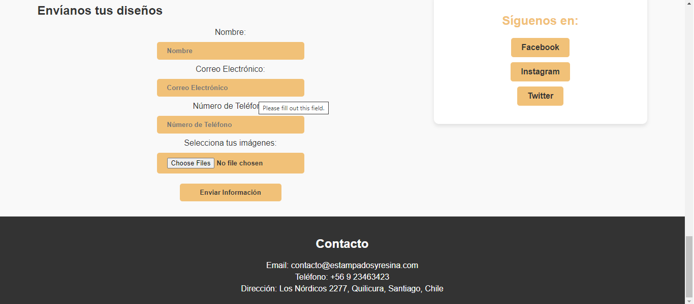

# Landing page de Negocio.

Este proyecto consiste en un sitio web para "Estampados y Resinas", un negocio dedicado a la personalizacion de productos a traves de tecnicas de estampado y la creacion de piezas unicas con resina epoxica.
## Caracteristicas

- **Disenio Atractivo:** El sitio cuenta con un disenio profesional y atractivo, utilizando una combinacion de colores crema, negro y dorado para transmitir elegancia.
- **Secciones Bien Definidas:** Las distintas secciones del sitio estan claramente separadas y organizadas, facilitando la navegacion del usuario.
- **Funcionalidades Destacadas:**
  - Envio de Disenios: Los usuarios pueden enviar sus propios disenios a traves de un formulario integrado en el sitio.
  - Galeria de Trabajos: Se incluye una galeria de imagenes que muestra los trabajos realizados por el negocio.
- **Responsive:** El sitio esta diseniado para ser completamente responsive, adaptandose a diferentes tamanios de pantalla para una experiencia de usuario optima en dispositivos moviles y de escritorio.

## Tecnologias Utilizadas

- HTML
- CSS
- JavaScript
- PHP

## Instrucciones de Uso

1. Clona este repositorio en tu maquina local.
2. Abre el archivo `index.html` en tu navegador web para visualizar el sitio.
3. Explora las diferentes secciones del sitio utilizando la barra de navegacion.

## Boceto.

## Apariencia.

## Contribuyendo

Si deseas contribuir a este proyecto, ¡no dudes en enviar un pull request!

## Autores

- [Luis Piro](https://github.com/LuisPiro) - Desarrollador principal

## Licencia

Este proyecto esta bajo la Licencia [MIT](https://opensource.org/licenses/MIT) - ver el archivo [LICENSE](LICENSE) para mas detalles.
